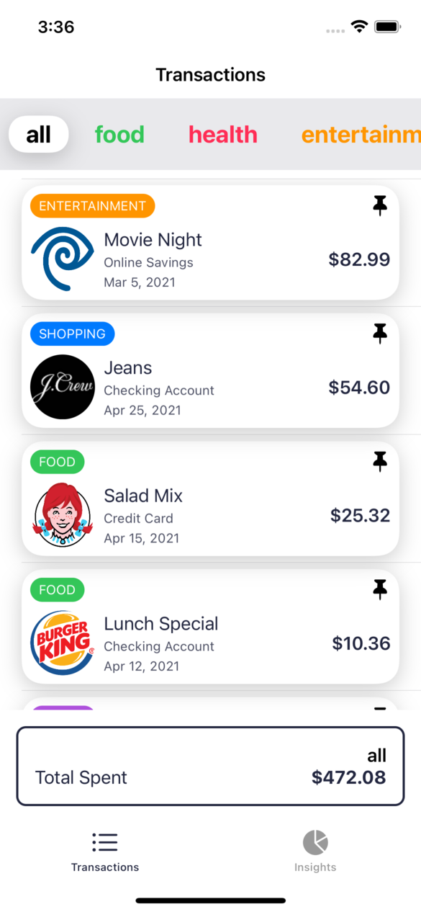

# Jonathan Agarrat - iOS Junior Tech Challenge - Take Home Challenge

## Branches 
- ### main 
  Contains the first submitted code 

	
	

- ### just-for-fun
  Conatins a redesigned app

	
	
	
- ### senior-attempt
  Conatins the rings view from the senior challenge

	
	

## Assignments 

General points to consider:
- follow the specs carefully
- focus on writing clean, maintainable code
- write your UI code in SwiftUI, not UIKit

### 1. Filtering buttons ✅

Add a horizontally scrolling view with buttons for the different categories (shopping, entertainment, food, etc). When the user taps on each of these, the list below should show only the transactions for the selected category. Add a button for all categories as well.

Play the following video to see the feature in action (note: if seeing inside Xcode video may not show fully):

Here are the design specs for the scrolling list of buttons and the buttons themselves:

### 2. Floating sum view    ✅

Add a floating view at the bottom of the list displaying the sum for the transactions belonging to the selected category. The sum should update when the user chooses the different categories.

Play the following video to see the feature in action:

Here are the design specs for the floating view with the sum of the chosen transactions:

### 3. Add a pin/unpin action to each transaction    ✅

By tapping on it, the UI should blend/unblend accordingly. The sum in the floating view at the bottom should only consider pinned transactions.

Play the following video to see the feature in action:

Here are the design specs for the unpinned transaction view and the pin/unpin icon:

### 4. Update the list in the insights tab to reflect expense in each category  ✅

The insights view should only consider pinned transactions.

Make sure that the state between the transactions and the insights tab is kept consistent, as shown in this video capture:

### 5. Unit tests  ✅

Write unit test to verify:

- filtering of transactions according to category
- sum of transaction amounts for filtered category

## Wrapping up

Once you have completed the assignments, please follow the instructions provided. Please, make sure that your project is complete and it is ready to be compiled and tested using the latest stable version of Xcode.

Good luck!
